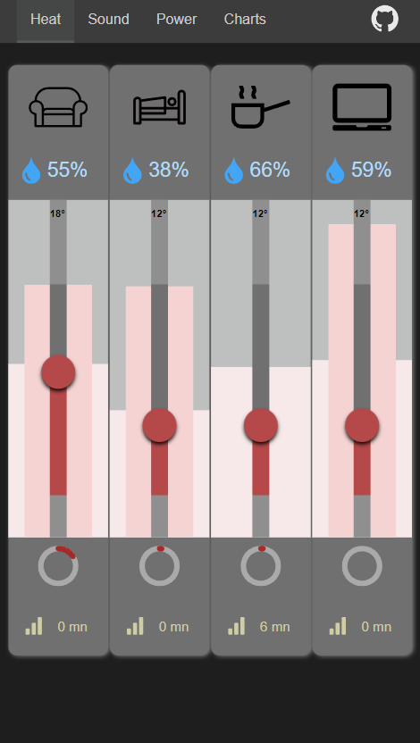

# astro home control

* Home Automation MQTT Client running on Astro as SSR
* Client page update with Server Sent Events
* Custom switches with feedback and custom sliders with animated SVG

## credits
- https://www.svgrepo.com/svg/194922/bathtub-bathroom
- https://www.svgrepo.com/svg/338007/accommodation-hotel-bed-sleeping
- https://www.svgrepo.com/svg/242592/kitchen-pack-steam
- https://www.svgrepo.com/svg/19017/laptop
- https://www.svgrepo.com/svg/131063/sofa
- https://www.svgrepo.com/vectors/signal/
